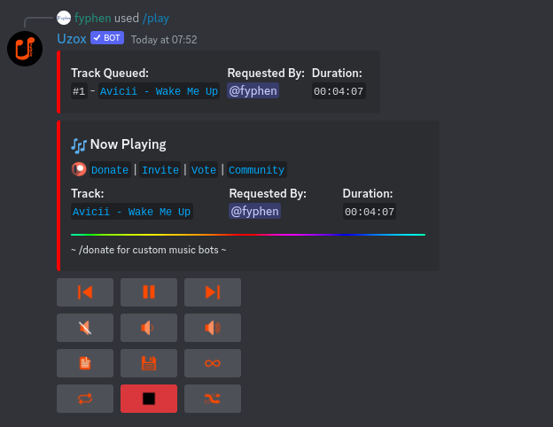
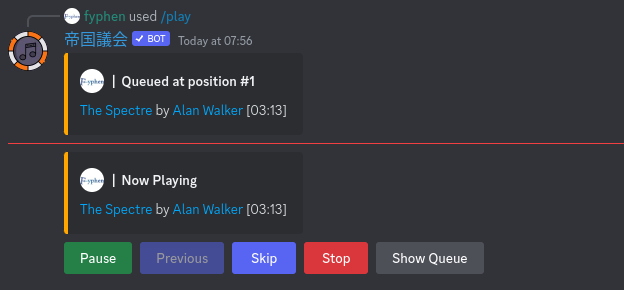

# Discord-MusicBotList

## Lara
Invite Link: [Link](https://discord.com/oauth2/authorize?client_id=944016826751389717&permissions=8&scope=bot%20applications.commands)

Status: Stable

Open Source: False

Image: 

Functions evaluation: 9/10

Overall: 9/10

## Uzox
Invite Link: [Link](https://discord.com/oauth2/authorize?client_id=760027263046909992&permissions=8&scope=bot+applications.commands)

Status: Stable

Open Source: [GitHub](https://github.com/uzox/uzox) 

Image: 

Functions evaluation: 10/10

Overall: 9/10

Overall: 9/10

## Chip
Invite Link: [Link](https://chipbot.gg/invite/chip)

Status: Stable

Open Source: False 

Image: 

Functions evaluation: 8/10

Overall: 8/10

## Chip
Invite Link: [Link](https://chipbot.gg/invite/chip)

Status: Stable

Open Source: False 

Image: 

Functions evaluation: 8/10

Overall: 8/10
